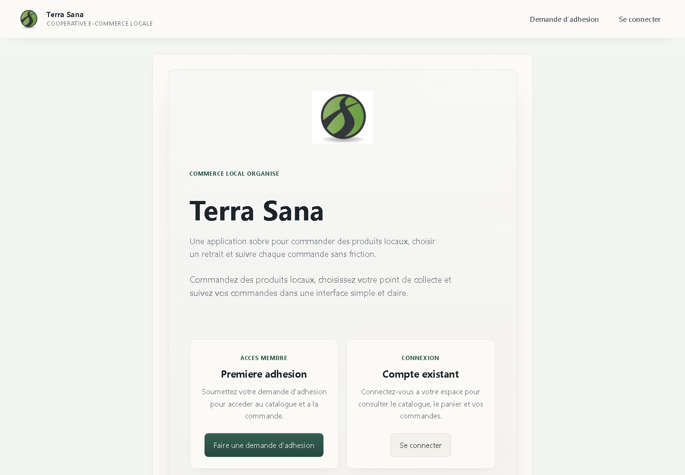
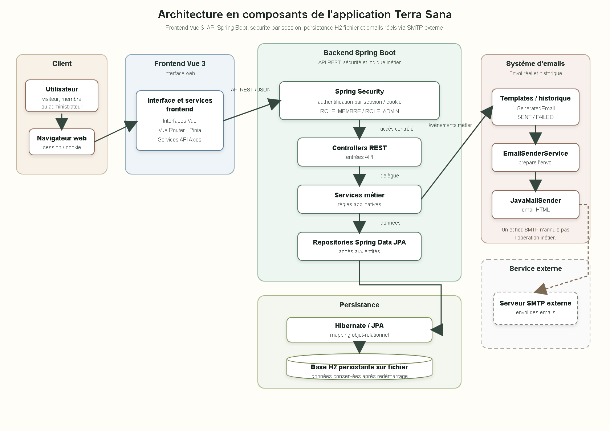
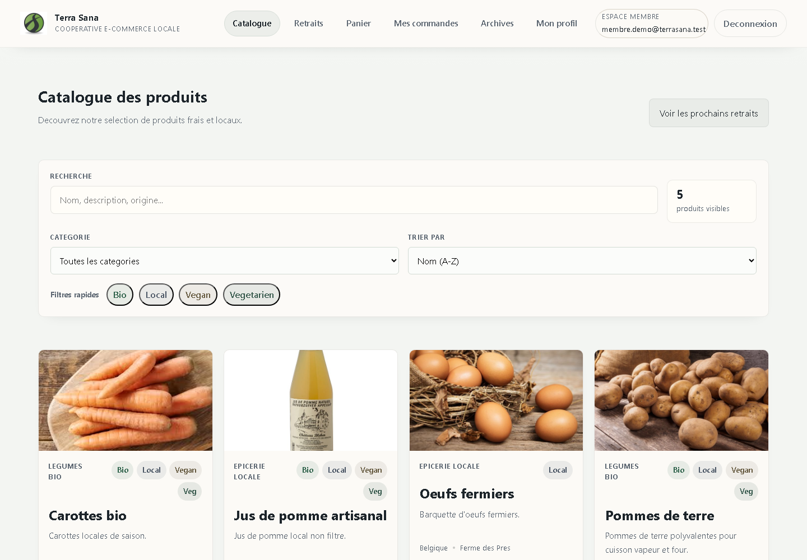
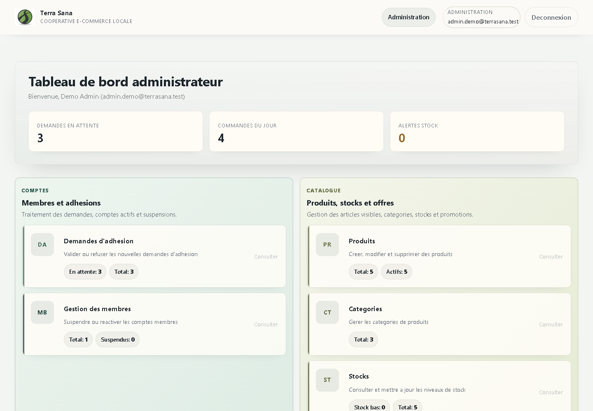
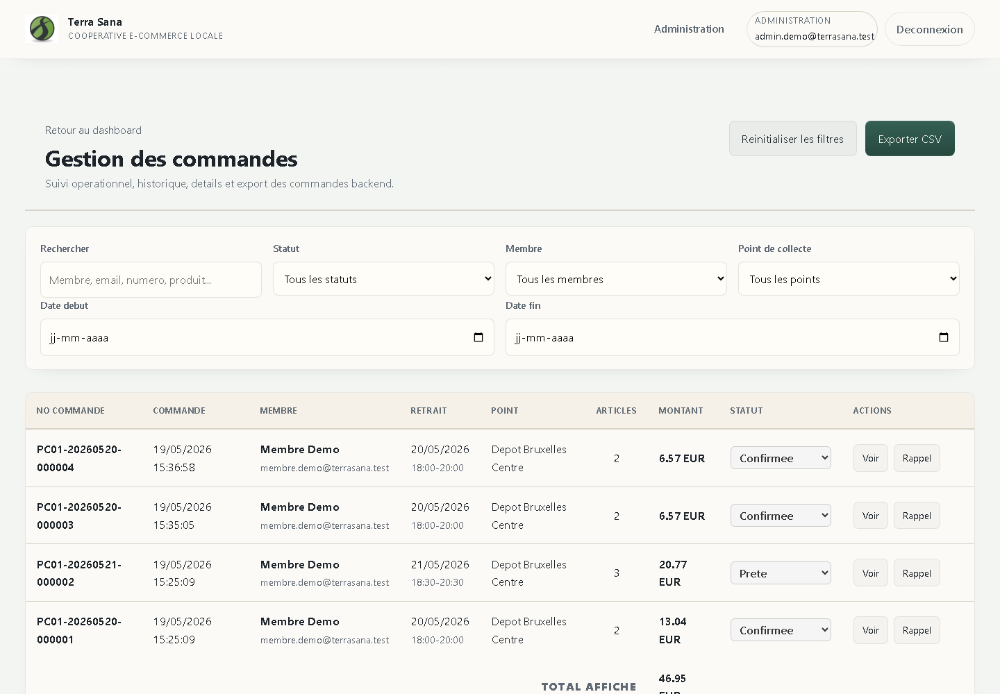
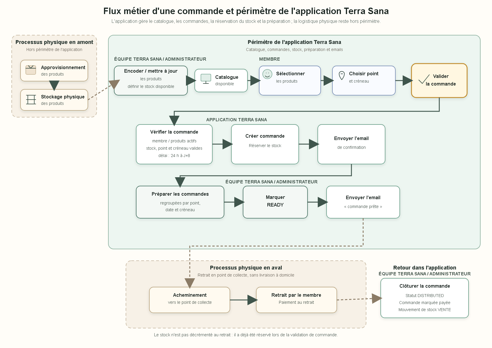

# Terra Sana

Application e-commerce privée développée pour organiser la vente de produits alimentaires locaux, les adhésions, les commandes et les retraits en point de collecte.



## Aperçu

Terra Sana couvre deux espaces complémentaires :

- **Membre** : authentification, catalogue, panier, choix du point et du créneau de retrait, commande, annulation et suivi.
- **Administration** : adhésions, membres, catalogue, stocks, commandes, promotions, collectes, exports et notifications email.

Le backend reste la source de vérité pour les règles critiques : disponibilité, calcul des prix, droits d'accès, réservation du stock et transitions de commande.

## Points techniques

- Authentification par session Spring Security avec rôles `MEMBRE` et `ADMIN`.
- Mots de passe BCrypt, réponses REST `401/403` et protection contre la fixation de session.
- Validation des commandes entre 24 heures et 8 jours avant le retrait.
- Verrouillage pessimiste du produit et champ `@Version` pour les commandes concurrentes.
- Historique des mouvements `RESERVATION`, `ANNULATION`, `VENTE` et `AJUSTEMENT`.
- Promotions par produit ou catégorie, calculées côté backend.
- Envoi SMTP réel avec historique `PENDING`, `SENT` ou `FAILED`.
- Rappel automatique J-1, idempotent, planifié en heure de Bruxelles.
- Base H2 persistante en local et H2 en mémoire exclusivement pour les tests.
- Exports CSV compatibles avec les tableurs francophones.

## Stack

| Partie | Technologies |
|---|---|
| Frontend | Vue 3, Vite, Pinia, Vue Router, Axios |
| Backend | Java 17, Spring Boot 3, Spring Security, Spring Data JPA |
| Données | Hibernate, H2 fichier, H2 mémoire pour les tests |
| Qualité | JUnit 5, Mockito, AssertJ, Gradle, GitHub Actions |

## Architecture



Le frontend appelle une API REST JSON avec cookies de session. Les contrôleurs délèguent aux services métier, qui utilisent les repositories JPA. Les notifications SMTP sont historisées sans annuler l'opération métier en cas d'échec d'envoi.

## Captures

| Catalogue membre | Tableau de bord administrateur |
|---|---|
|  |  |

| Gestion des commandes | Flux métier |
|---|---|
|  |  |

## Lancer le projet

### Windows : lancement en un clic

Le dossier `launcher/` permet de créer deux raccourcis sur le Bureau : `Terra Sana` démarre silencieusement le backend et le frontend puis ouvre l'application, tandis que `Arrêter Terra Sana` ferme les processus lancés par ce raccourci.

```powershell
powershell -ExecutionPolicy Bypass -File .\launcher\Install-DesktopShortcuts.ps1
```

Les journaux de démarrage sont conservés localement dans `.terra-sana-runtime/` et ne sont pas versionnés.

### Prérequis

- JDK 17 ou supérieur
- Node.js 20 ou supérieur

### Backend

```powershell
cd "Back End Java"
./gradlew.bat bootRun
```

L'API démarre sur `http://localhost:8081`. La base locale est créée dans `Back End Java/data/` et n'est pas versionnée.

L'envoi d'emails est facultatif. Pour l'activer, copier `config/application-secrets.example.properties` vers `config/application-secrets.properties`, renseigner ses propres paramètres SMTP et conserver ce fichier uniquement en local.

### Frontend

```powershell
cd "Front End VUE3"
npm ci
npm run dev
```

L'interface est disponible sur `http://localhost:5173`.

## Vérifications

```powershell
cd "Back End Java"
./gradlew.bat test
./gradlew.bat build

cd "../Front End VUE3"
npm ci
npm run build
```

La CI exécute automatiquement les tests backend et le build des deux applications à chaque push et pull request.

## Périmètre

Ce projet a été réalisé dans le cadre d'un travail de fin d'études. Il vise un fonctionnement local complet et démontrable. Le paiement en ligne, le déploiement de production et la logistique de transport ne font volontairement pas partie du périmètre.
